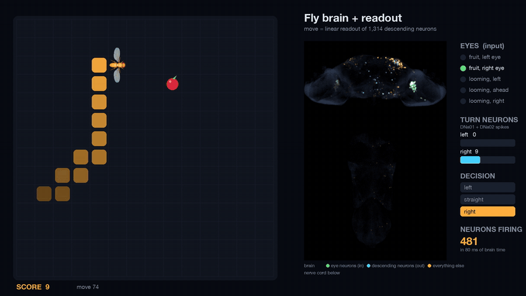
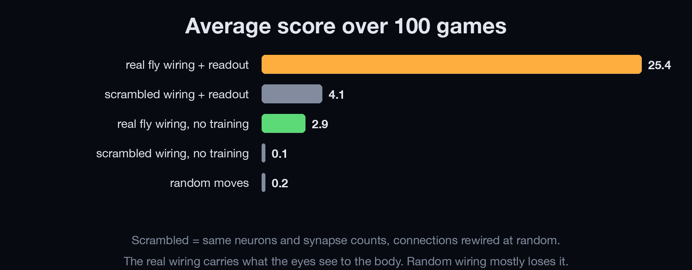
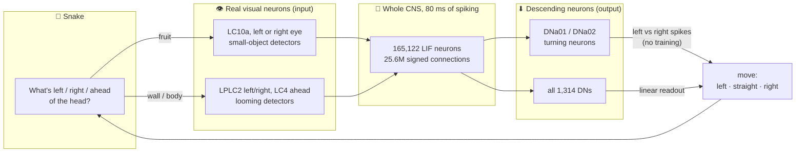
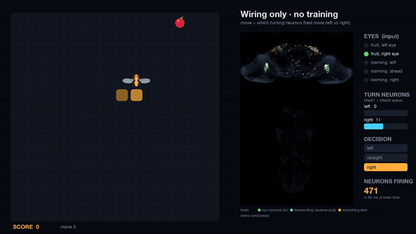

<div align="center">

# 🪰 flybrain-snake

### A real fruit fly nervous system, simulated neuron by neuron, playing Snake.

**165,122 neurons · 25.6 million connections · 124 million synapses · simulated live on a laptop**



*Left: the game (the snake's head is the flybody fly). Right: every spike in the fly's brain (top) and nerve cord (bottom), drawn at each neuron's real position.*

[**▶ Full demo video (65 s)**](media/fly_plays_snake.mp4) · [How it works](#how-it-works) · [Results](#results) · [Is the fly actually playing?](#so-is-the-fly-actually-playing) · [Run it](#run-it-yourself)

</div>

---

## Why this exists

In September 2026, Google Research and HHMI Janelia published **MaleCNS v1.0**, the first complete wiring
diagram of an adult fruit fly's entire central nervous system (brain + nerve cord). Within days the internet had
the fly brain playing Minecraft, Doom, Beat Saber, solving Rubik's cubes and trading Bitcoin.

Fun, but almost none of those demos answer the obvious question:

> **Is the fly's wiring doing anything, or would any big network with a trained output do the same?**

This project plays Snake with the real connectome **and** with the controls: scrambled wiring, no training, random
play. It also shows exactly which neurons are used, so you can judge for yourself.

## TL;DR

- 🧠 **Zero training, real behavior.** Show fruit to the fly's left eye and its *left* turning neurons fire; right eye,
  right neurons. Nobody programmed that. It falls straight out of the wiring (the circuit male flies use to chase females).
  The fly steers toward fruit with no learning at all.
- 🧱 **But it can't avoid walls.** Looming "danger" signals don't reach the turning neurons, so the untrained fly
  crashes after a few fruits. Biologically, looming mostly triggers escape (the giant fiber takeoff pathway), not these steering neurons.
- 📈 **With a small learned readout it scores 25 per game.** The brain itself is never trained; a linear
  translator learns to read its 1,314 descending neurons.
- 🔀 **Scrambled wiring collapses to 4.** Same neurons, same synapse counts, random targets: the eye signals mostly
  never reach the output. **The real wiring matters.**

<div align="center">

</div>

---

## How it works



Every single move:

1. **Senses become neuron stimulation.** Fruit on the snake's left drives the fly's left-eye **LC10a** neurons with
   150 Hz Poisson input; on the right, right-eye LC10a; straight ahead, both. A wall or body segment next to the head
   drives **LPLC2** (left/right) or **LC4** (ahead), the fly's looming detectors.
2. **The entire nervous system runs for 80 ms** of simulated time: 165,122 leaky integrate-and-fire neurons,
   wired as in the connectome (with the few changes listed under [Model details](#model-details)), each connection signed by the presynaptic neuron's predicted neurotransmitter.
3. **The move is read from descending neurons**, the ~1,300 neurons that are the brain's main line to the body:
   - **Wiring only:** compare spikes of the left vs right **DNa01/DNa02** turning neurons. No parameters, no training.
   - **Readout:** a linear decoder over all 1,314 descending neurons picks left / straight / right.

The brain starts fresh for each move, so each decision is 80 ms of pure sensory-driven activity.

### The zero-training result

<div align="center">

</div>

With no decoder at all, the connectome routes left-eye object signals to the left turning neurons and right to right:

| stimulus (80 ms) | left DNa01+DNa02 spikes | right DNa01+DNa02 spikes |
|---|---|---|
| fruit, left eye | **9** | 0 |
| fruit, right eye | 0 | **9** |
| looming, left | 0 | 0 |
| looming, right | 0 | 0 |

That fits the known biology: **LC10a** neurons drive the pursuit a courting male uses to keep a moving female in front
of him, and **DNa02** is a known steering neuron that turns the fly toward its own side. Here that pathway makes the fly chase fruit.

---

## Results

100 games per player on a 14×14 board. Brain responses used in games come from simulation runs the readout never saw.
Full numbers in [`results/scoreboard.json`](results/scoreboard.json).

| player | mean score | best | how it dies |
|---|---:|---:|---|
| **real wiring + readout (1,314 DNs)** | **25.4** | 50 | runs into itself (99/100) |
| scrambled wiring + readout (1,314 DNs) | 4.1 | 11 | itself 63, wall 37 |
| **real wiring, turning neurons only, zero training** | **2.9** | 11 | itself 91, wall 9 |
| scrambled wiring, turning neurons only, zero training | 0.1 | 1 | wall 100 |
| random moves | 0.2 | 2 | wall 99 |
| reference rule, no brain (upper bound) | 25.4 | 50 | itself 99 |

Descending neurons responding to each sense, real vs scrambled wiring:

| sense | real wiring | scrambled wiring |
|---|---:|---:|
| fruit, left eye | 51 | 6 |
| fruit, right eye | 68 | 5 |
| looming, left | 61 | 0 |
| looming, right | 62 | 2 |
| looming, ahead | 75 | 0 |

**Reading the table:** a decoder can only use what reaches the output. In the real connectome, what the eyes see
arrives at dozens of distinct descending neurons, cleanly separable into "fruit left / fruit right / danger here".
Randomly rewire the same synapses and that information mostly dissipates before it gets there.

---

## So is the fly actually playing?

Partly. Here is the honest breakdown:

| | real? |
|---|---|
| Wiring diagram (who connects to whom, how many synapses) | ✅ real MaleCNS v1.0 data |
| Input neurons (LC10a, LPLC2, LC4) and output neurons (DNa01, DNa02, all DNs) | ✅ real, annotated cell types |
| Fruit-left → turn-left with zero training | ✅ emerges from the wiring |
| Neuron dynamics | ⚠️ simplified: every neuron is the same LIF unit |
| Synapse strengths | ⚠️ approximated as synapse count × constant |
| Snake skill of the 25-point player | ⚠️ mostly the readout, fitted to a simple "avoid danger, approach fruit" rule. The wiring's contribution is delivering the information intact |
| Learning, hunger, neuromodulation, a body | ❌ not modeled |

The 25-point player is a translator trained on top of a fixed brain. That's the same trick as the viral demos, but
here you can see what the brain contributes (compare the scrambled row) and what it does on its own (the zero-training row).

---

## Model details

Base model: the whole-brain LIF model of Shiu et al. 2024, *Nature*.

| parameter | value |
|---|---|
| resting / reset potential | −52 mV |
| threshold | −45 mV |
| membrane τ | 20 ms |
| synaptic τ | 5 ms |
| refractory period | 2 ms |
| synaptic delay | 2 ms |
| time step | 1 ms (paper: 0.1 ms) |
| input drive | Poisson, 150 Hz, 68.75 mV per event |
| sign | acetylcholine +, GABA / glutamate / histamine − |

### Changes I had to make, and why

Run with the paper's settings, **the MaleCNS locks into self-sustaining activity**: ~20,000 neurons keep firing
long after the stimulus stops (for as long as I simulated), mostly Kenyon cells (mushroom body), antennal-lobe projection neurons and optic-lobe
loops. A brain stuck in a seizure can't respond to anything, so:

| change | reason |
|---|---|
| synapse gain 0.275 → **0.1 mV** per contact | the paper's value was calibrated on a different connectome (FlyWire); here it saturates |
| **spike-frequency adaptation** (3 mV/spike, τ 200 ms) | real neurons adapt; the base model doesn't |
| dopamine / serotonin / octopamine **not fast synapses** | they act as slow modulators, not spike-by-spike excitation |
| **Kenyon cell ↔ Kenyon cell** contacts dropped | dense axo-axonic synapses that drove the runaway loop |
| **inputs onto sensory neurons** dropped | sensory neurons are driven by the world here, not by feedback |

After these, activity falls from ~1,000 active neurons to ~100 within 60 ms of the stimulus ending instead of self-sustaining, and the zero-training steering result appears.

### Things that didn't work (also results)

- **Smell as the fruit sense.** Stimulating left vs right antenna food-odor receptor neurons (ORN DM1/DM2/DM4/VM2)
  gave descending-neuron responses with correlation **0.99**: in the fly, each antenna's receptor neurons project to
  *both* sides of the brain, so the side is lost. Vision keeps it, so vision it is.
- **A readout on just the 4 turning neurons** scores 0.5: they only carry the fruit direction, not danger.

---

## Run it yourself

Requires Python 3.11+, ~2 GB disk, ~8 GB RAM. Tested on an M-series MacBook.

```sh
git clone https://github.com/charbelkassab/flybrain-snake.git
cd flybrain-snake
python3 -m venv .venv && .venv/bin/pip install -r requirements.txt

./scripts/download_data.sh                 # 1.1 GB of connectome tables from Janelia
.venv/bin/python build_connectome.py       # -> data/brain.npz (signed sparse matrix), ~1 min
.venv/bin/python experiment.py             # scoreboard + decoders, ~1 min
.venv/bin/python demo.py                   # -> videos/fly_plays_snake.mp4, ~2 min
```

`demo.py` uses macOS system fonts (Helvetica Neue); on Linux, change `FONT` at the top of the file.

Things to try:

- Swap the eye neurons in `brain.py` (`FOOD_TYPES`, `DANGER_SIDE`, `DANGER_AHEAD`): e.g. `LC11`, `LC18`, `LPLC1`.
- Swap the output neurons (`STEER_TYPES`): e.g. `DNb05`, `DNg13`.
- "Lesion" the brain: zero a cell type's columns in the matrix and watch the steering disappear.
- Remove one of the model changes above and watch the runaway activity come back.

## Repository layout

```
brain.py               LIF simulator, stabilisation, scrambled-wiring control, input/output neuron sets
snake.py               the game, relative senses, reference rule
experiment.py          records brain responses, fits readouts, plays 100 games per player
demo.py                renders the video (live simulation, spike glow at real soma positions)
build_connectome.py    Janelia feather files -> signed sparse matrix
scripts/               data download
results/               scoreboard + fitted readouts
media/                 video, GIFs, figures
assets/fly_top.png     top-down render of the flybody fly model
```

## Credits

- **Connectome:** MaleCNS v1.0, Google Research & HHMI Janelia FlyEM, *Cell* (2026).
  [male-cns.janelia.org](https://male-cns.janelia.org/), CC-BY 4.0.
- **Whole-brain LIF model:** Shiu, P.K. et al. *A Drosophila computational brain model reveals sensorimotor
  processing.* Nature 634, 210–219 (2024).
- **Fly body model** (snake head sprite): flybody, Vaxenburg, R. et al. *Whole-body physics simulation of fruit fly
  locomotion.* Nature (2025), [TuragaLab/flybody](https://github.com/TuragaLab/flybody), Apache 2.0.
- **Steering neurons:** Rayshubskiy, A. et al. *Neural circuit mechanisms for steering control in walking Drosophila* (2020);
  LC10a pursuit pathway: Ribeiro, I.M.A. et al. (2018), Hindmarsh Sten, T. et al. (2021).

## License

Code: [MIT](LICENSE). Connectome data is not redistributed here; it is CC-BY 4.0 from Janelia and downloaded by the script.
